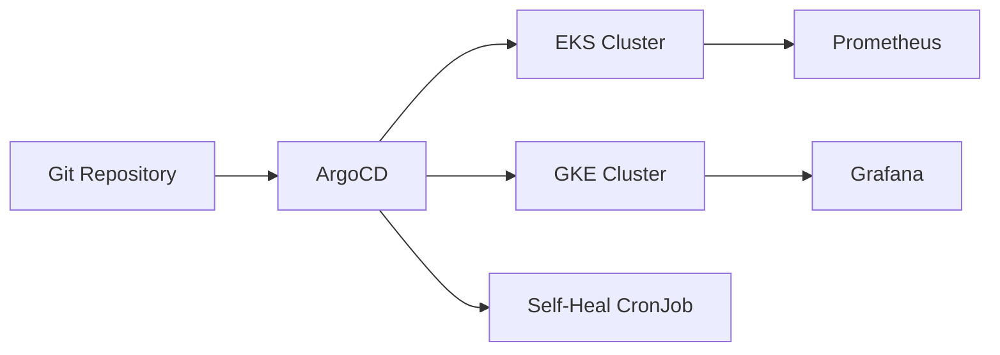

# 🚀 Cross-Cloud GitOps Platform

### Terraform • ArgoCD • Kubernetes • AWS EKS • GCP GKE

[](https://github.com/junaid-13/Cross_Cloud_GitOps/actions)
[](https://argo-cd.readthedocs.io/)
[](https://www.terraform.io/)
[](https://kubernetes.io/)
[](./LICENSE)

---
## 🌍 Overview

The **Cross-Cloud GitOps Platform** brings together **Terraform**, **ArgoCD**, and **Kubernetes** to automate multi-cloud infrastructure and application delivery.  
It’s built for **AWS (EKS)** and **GCP (GKE)** — helping teams manage deployments declaratively with Git as the single source of truth.

This platform enables:

- Multi-cloud provisioning and GitOps delivery  
- Self-healing and drift correction  
- Centralized monitoring and logging  
- Seamless failover between clouds  

---

## ⚡ Key Highlights

- **Terraform-based Multi-Cloud Infra** — EKS on AWS and GKE on GCP  
- **GitOps Deployments** via ArgoCD (App-of-Apps pattern)  
- **Self-Healing Automation** through ArgoCD sync jobs  
- **Observability Stack** with Prometheus, Grafana, Alertmanager, and Loki  
- **Cross-Cloud DR Support** — automatic or manual failover  
- **CI/CD Validation** through GitHub Actions  
- **Secure by Design** — RBAC, Kubernetes Secrets, and cloud-native encryption  

---

## 🏗️ Architecture


---
## ⚙️ Quick Start
### 1️⃣ Clone the Repository
```bash
Copy code
git clone https://github.com/junaid-13/Cross_Cloud_GitOps.git
cd Cross_Cloud_GitOps
```
### 2️⃣ Prerequisites
- Install and configure:
- Terraform ≥ v1.6
- kubectl ≥ v1.25
- Kustomize ≥ v5
- AWS CLI & gcloud SDK
- ArgoCD CLI

Verify setup:
```bash
Copy code
terraform -version
kubectl version --client
kustomize version
argocd version
```
### 3️⃣ Run the Bootstrap Script
```bash
Copy code
chmod +x bootstrap.sh
./bootstrap.sh | tee bootstrap.log
```
This will:
- Provision AWS & GCP clusters
- Configure contexts
- Install ArgoCD
- Deploy GitOps apps (infra, observability, automation)

---

## ☁️ Access ArgoCD
Check pods and expose ArgoCD locally:

```bash
kubectl get pods -n argocd
kubectl port-forward svc/argocd-server -n argocd 8080:443 --address "<enter-your-address>" &
```
Login:

```bash
argocd login localhost:443 --address localhost \
  --username admin \
  --password $(kubectl -n argocd get secret argocd-initial-admin-secret \
    -o jsonpath="{.data.password}" | base64 -d)
```
Access the UI: https://youraddress:8080

---

## 🧠 Verify Deployments
List and sync apps:

```bash
argocd app list
argocd app sync --all
```
Check workloads:
```bash
Copy code
kubectl get pods -A
```
You should see:
- argocd
- observability
- automation
- sample-app

---

## 📊 Observability
### Access Grafana dashboards:

```bash
kubectl port-forward svc/grafana -n observability 3000:3000
```
Open → http://localhost:3000

Monitor logs, alerts, and performance metrics across both clusters.

---

### 🔁 Self-Healing Automation
Check or trigger the automation job:

```bash
kubectl get cronjobs -n automation
kubectl create job manual-heal --from=cronjob/self-heal -n automation
```
This automatically reconciles drift and restores the desired state.

## ☁️ Disaster Recovery (DR)
Switch to GKE if EKS becomes unavailable:

```bash
kubectl config use-context gke_cluster_context
argocd app sync --all
```
Your workloads continue to operate with minimal downtime.

---

## 🔐 Security & CI/CD
- RBAC and namespace-level isolation
- Kubernetes Secrets for sensitive data
- Encrypted storage with AWS KMS & GCP CMEK
- GitHub Actions automatically validates:
    - Terraform formatting
    - Kubernetes manifests (Kustomize build)

---

## ✅ Quick Health Check
| Component         | Status                         |
|-------------------|--------------------------------|
| Terraform Infra   | ✅ Deployed via `bootstrap.sh`  |
| ArgoCD            | ✅ Running                      |
| Observability     | ✅ Healthy                      |
| Self-Healing      | ✅ Active                       |
| Disaster Recovery | ✅ Verified                     |
| CI/CD Pipeline    | ✅ Working                      |


---

## 🤝 Contributing
Have an idea, improvement, or fix?
Fork the repo, make your changes, and submit a pull request — contributions are always welcome!

---

## 🌟 Support
If this project helps you, consider ⭐ starring the repo.
It really helps visibility and encourages continued improvements.

---

## 🧩 Topics
gitops • terraform • argocd • kubernetes • eks • gke • observability • self-healing • drift-detection • devops

---

## 📄 License
MIT License © 2025 Junaid
All rights reserved.
